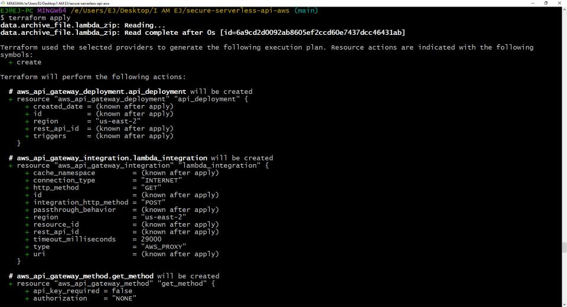
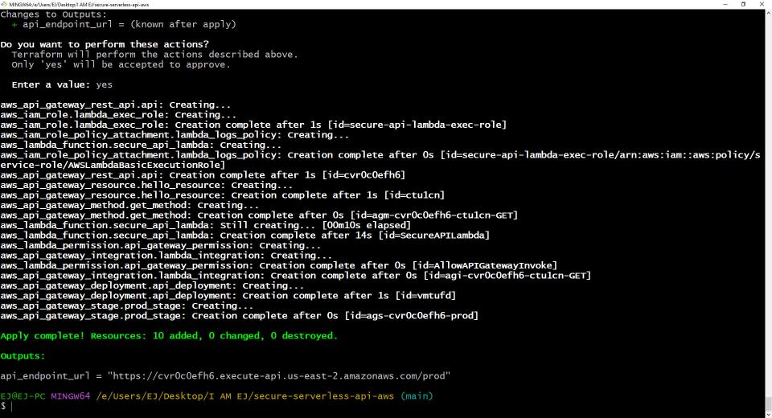
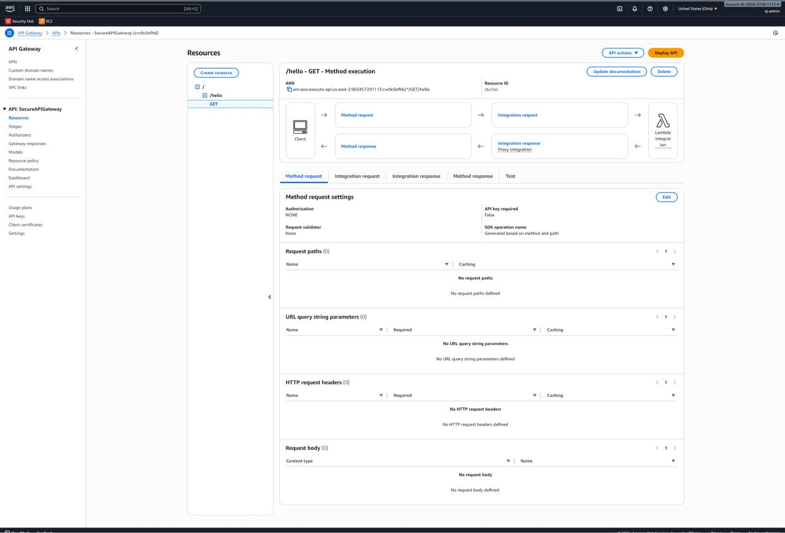
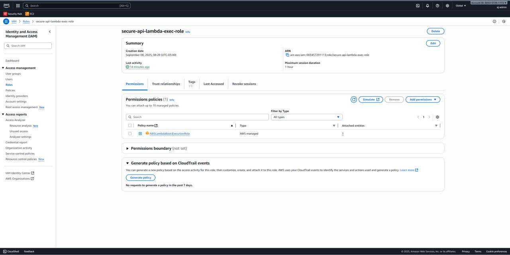

# Secure Serverless API with AWS Lambda & Terraform

## Objective
This project demonstrates the ability to build and deploy a secure, cloud-native REST API using Python, AWS Lambda, and API Gateway. The project's core focus is on security, specifically the implementation of a fine-grained, least-privilege IAM role. The entire infrastructure is defined and deployed using Terraform.

## Tools & Technologies Used
* **Terraform:** For defining and managing the infrastructure as code (IaC).
* **AWS Lambda:** For the serverless compute function (backend logic).
* **AWS API Gateway:** To create the public-facing REST API endpoint.
* **AWS IAM:** To define and enforce the least-privilege security policy.
* **Python:** For the Lambda function's application code.
* **Git & GitHub:** For version control.

---
## Security Focus: Least-Privilege IAM Role
The cornerstone of this project's security design is the IAM execution role created for the Lambda function. Instead of granting broad permissions, the role is strictly limited to the absolute minimum necessary for the function to operate: the ability to write logs to Amazon CloudWatch. This is achieved by attaching the AWS-managed `AWSLambdaBasicExecutionRole` policy. This demonstrates a professional, security-first approach to building cloud applications.

---
## Usage

### Prerequisites
* [Terraform](https://developer.hashicorp.com/terraform/downloads) installed.
* [AWS CLI](https://aws.amazon.com/cli/) installed and configured with appropriate credentials.

### Deployment & Teardown
1.  Clone this repository to your local machine.
    ```bash
    git clone [https://github.com/iamejdev/secure-serverless-api-aws.git](https://github.com/iamejdev/secure-serverless-api-aws.git)
    cd secure-serverless-api-aws
    ```
2.  Initialize the Terraform working directory.
    ```bash
    terraform init
    ```
3.  Preview the changes that Terraform will make.
    ```bash
    terraform plan
    ```
4.  Apply the configuration to deploy the resources.
    ```bash
    terraform apply
    ```
5.  To avoid incurring AWS charges, destroy all created infrastructure when finished.
    ```bash
    terraform destroy
---

## Deployment Verification
The successful deployment and secure configuration of the serverless API was confirmed through the following steps.

### 1. Terraform CLI Output
The `terraform apply` command completed successfully, showing all resources created and outputting the final API endpoint URL.



### 2. Successful API Test
Accessing the API endpoint URL in a browser returned the correct JSON response, confirming the application is live and working.


### 3. API Gateway Configuration
The API Gateway console showed the successfully deployed "prod" stage and the "/hello" resource with its public GET method.


### 4. Least-Privilege IAM Role
The IAM console confirmed that the Lambda function's execution role has only one attached policy: `AWSLambdaBasicExecutionRole`, enforcing the principle of least privilege.
